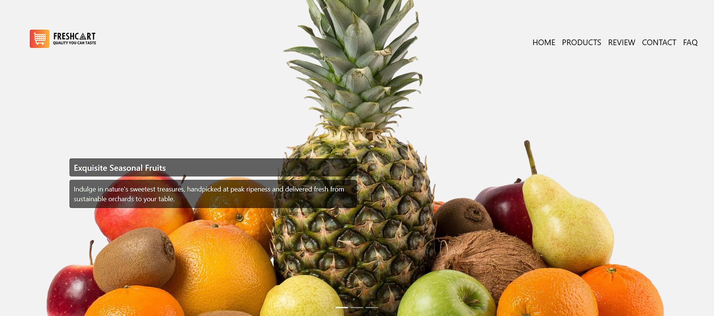
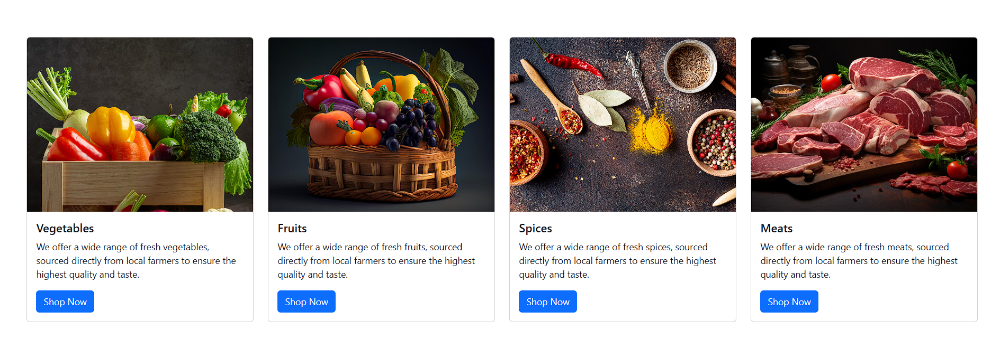
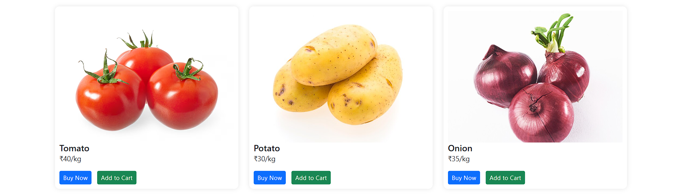
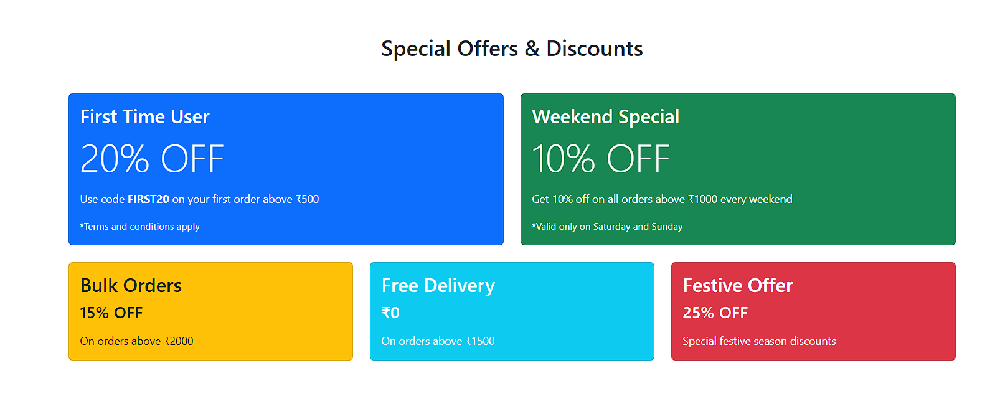
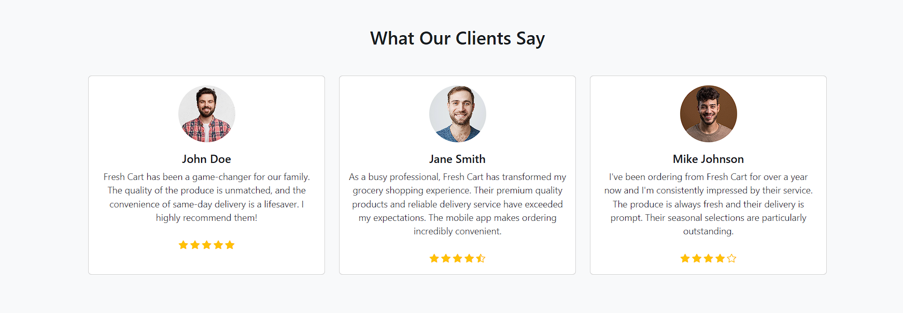
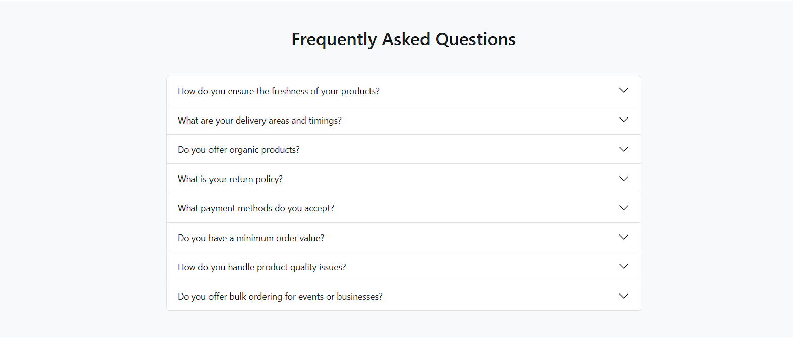

# Fresh Cart - Premium Online Grocery Store

## Overview
Fresh Cart is a modern e-commerce website built with Bootstrap that delivers high-quality groceries, fresh produce, and premium meats directly to customers' doorsteps. Launched in 2020, we focus on providing an exceptional online shopping experience with carefully curated products from sustainable sources. The site leverages Bootstrap's responsive grid system, components, and utilities to create an intuitive and mobile-friendly interface.

## Features
- Responsive navigation bar with easy access to all sections
- Dynamic carousel showcasing featured products and offers
- Categorized product sections including:
  - Seasonal fruits
  - Organic vegetables 
  - Premium grade meats
  - Spices
- Customer reviews section
- FAQ section
- Contact Form for customer inquiries and feedback

## Technologies Used
- HTML5
- CSS3
- Bootstrap 5.3.2
- Bootstrap Icons

## Design Elements
- Responsive design that works across all devices
- Custom styling for product cards and navigation
- High-quality product imagery
- Optimized performance

## Live Demo
Check out the live website: [Fresh Cart](https://freshcart.example.com)

## Screenshots

*Homepage with featured carousel*

*Product categories and listings*

*Products and Prices*

*Offers and Discounts*

*Customer testimonials and reviews*

*Frequently asked questions*

